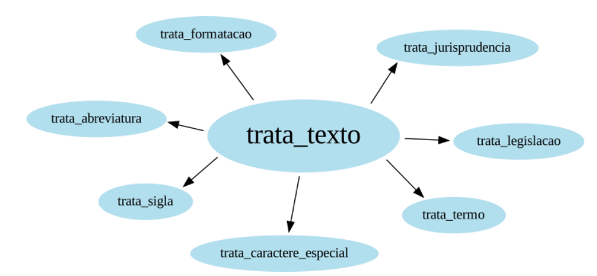
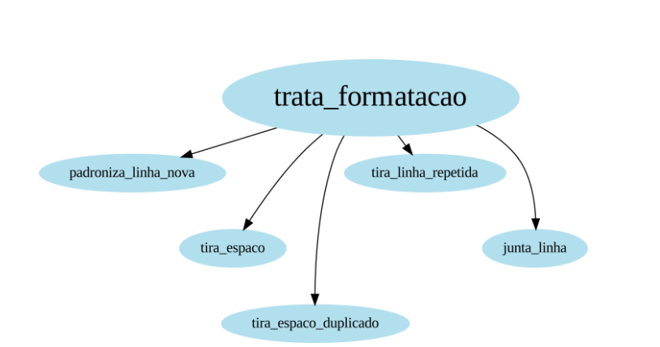
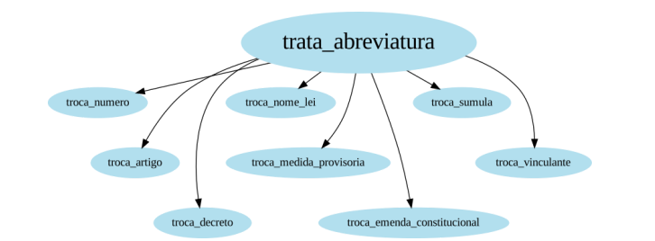
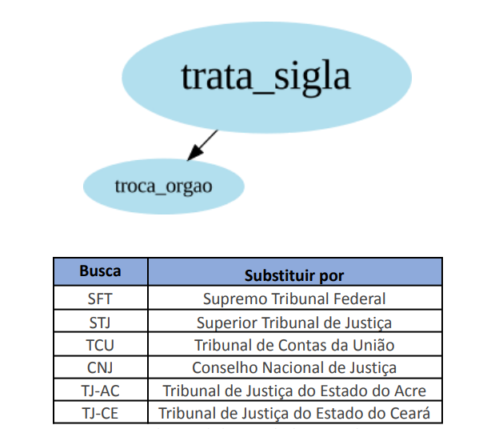
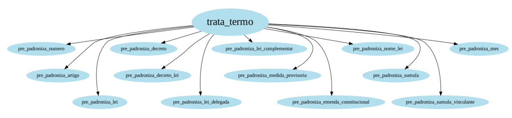
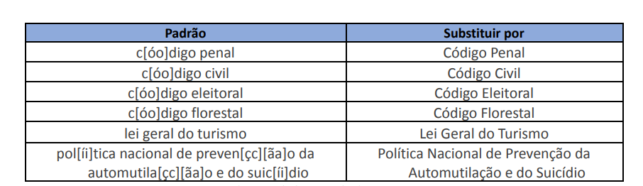
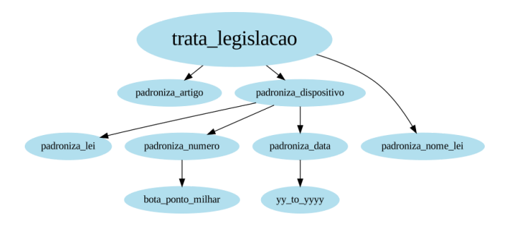
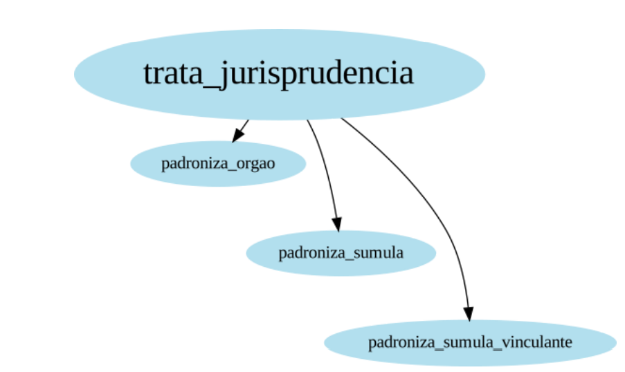
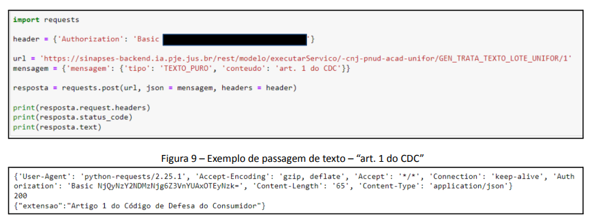

Trata Texto em Lote
-------------------

As ferramentas de correção textual para a Língua Portuguesa têm avançado com o uso de Inteligência Artificial. Entretanto, esse avanço não é uniforme para os textos de todas as áreas do conhecimento. Aqui, introduzimos uma ferramenta de correção textual para documentos jurídicos, através da utilização de Expressões Regulares. O objetivo do TrataTexto é padronizar as referências às legislações e jurisprudências presentes em um grande conjunto de petições. O TrataTexto em Lote é um código desenvolvido em Python que combinado com a biblioteca regex, localiza e corrige/padroniza algumas palavras no texto. O fluxo de processo definido consiste em uma entrada de texto, um processamento (algoritmo) e uma saída de texto.

A Arquitetura
-------------

A função principal do Trata Texto em Lote, chamada de TrataTexto(), consiste na aplicação de forma sequencial das seguintes funções: TrataFormatacao(), TrataAbreviatura(), TrataSigla(), TrataCaractereEspecial(), TrataTermo(), TrataLegislacao() e TrataJurisprudencia(). A seguir descrevemos cada uma dessas funções.

### Trata Formatação

A função TrataFormatacao() tem o objetivo de corrigir características relacionadas a formatação dos textos dos documentos. Em nossas análises, identificamos alguns padrões que precisavam de correção. Inicialmente, padronizamos os caracteres de quebra de linha (newline) através da PadronizaLinhaNova(). Percebemos também poderiam existir espaços duplicados antes e depois das palavras, para isso criamos a função TiraEspaco(). Após removermos estes espaços, vimos que haviam espaços duplicados, daí fizemos uma outra função chamada TiraEspacoDuplicado(). Em seguida, vimos muitas linhas totalmente repetidas (e.g., cabeçalhos e rodapés). Quebramos o texto por linha e fizemos a remoção das duplicadas com a função TiraLinhaRepetida(). Finalmente, juntamos novamente todas as linhas com a função JuntaLinha().

### Trata Abreviatura

A função TrataAbreviatura() substitui algumas abreviaturas pela respectiva palavra por extenso. Por exemplo, variações da abreviatura “Art.” (Art, art, ART, etc) foram substituidas pela palavra “Artigo”.

### Trata Sigla

A função TrataSigla() substitui algumas siglas de órgãos pelo respectivos nomes por extenso. A tabela a seguir mostra alguns exemplos.

### Trata Caracter Especial

A função TrataCaractereEspecial() remove os seguintes caracteres especiais: “ ° ”, “ º ” e “ ª ”. Tais caracteres geravam problemas para a geração de embeddings.

### Trata Termo

A função TrataTermo() padroniza algumas palavras/termos para ajudar a padronização posterior das funções TrataLegislacao() e TrataJurisprudencia(). Por exemplo, a função PrePadronizaNomeLei() localiza as leis sem acentuação ou sem “ç” e faz a substituição pelo seu nome bem formatado. A tabela a seguir mostra alguns exemplos.

### Trata Legislação

A função TrataLegislacao() tem como objetivo padronizar as citações às legislações. De forma prática, dividimos a citação de uma legislação em duas partes: artigo (e.g., Art. 41) e dispositivo (e.g., Decreto-Lei 3.689/1941). Em seguida, a citação de um dispositivo é dividida em três partes: tipo da lei (Lei, Decreto-Lei, etc.), número da lei (3.689) e ano da lei (1941). Definimos ainda a função PadronizaNomeLei() que converte uma citação do tipo “Decreto-Lei 3.689/1941” para o apelido daquela lei (“Código de Processo Penal”). Nossa hipótese é que os apelidos de algumas leis dizem mais sobre o assunto da petição do que as citações no padrão “Lei NN.NNN/AAAA”.

### Trata Jurisprudência

A função TrataJurisprudencia() padroniza as citações às jurisprudência, em especial às súmulas e súmulas vinculantes.

Requisições
-----------

As requisições POST para esse serviço devem seguir o padrão de consulta do SINAPES. A seguir, mostramos um exemplo de consulta em Python, onde o “texto de entrada” é o valor da chave "conteudo" e o “texto de saída” é o valor da chave “extensao”.

